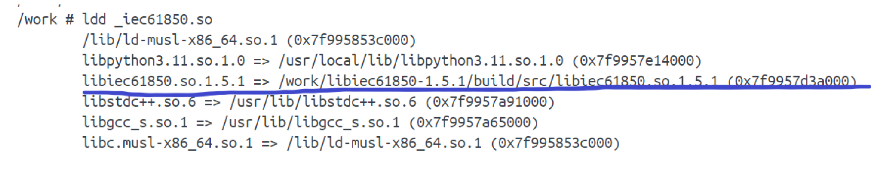
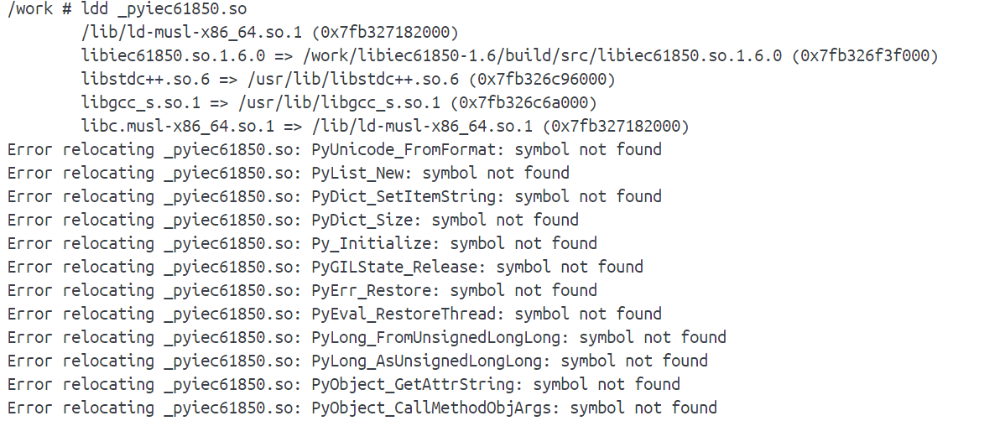
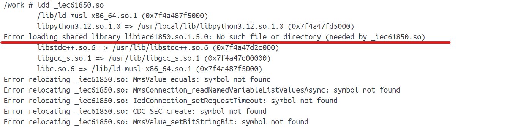
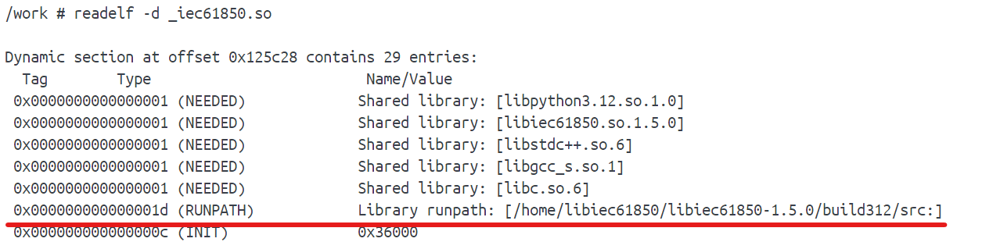
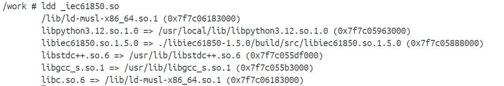

# pyIEC61850 - Python bindings of libIEC61850 

<!-- TOC -->
* [Table of Contents](#table-of-contents)
* [Quick links for documentation](#quick-links-for-documentation)
    * [General instructions for compiling the Python binding `pyiec61850`](#general-instructions-for-compiling-the-python-binding-pyiec61850)
    * [Quick Step-by-step workflow for compiling and testing `pyiec61850`](#quick-step-by-step-workflow-for-compiling-and-testing-pyiec61850)
* ["The" library `libIEC61850`](#the-library-libiec61850)
* [How to use the Python binding `pyIEC61850`](#how-to-use-the-python-binding-pyiec61850)
    * [Deploy `pyIEC61850` for Windows applications](#deploy-pyiec61850-for-windows-applications)
    * [Deploy `pyIEC61850` for linux applications](#deploy-pyiec61850-for-linux-applications)
    * [Important notions](#important-notions)
    * [Demo tester](#demo-tester)
    * [Quick debug for Linux (Changing runpath of the required dependency file)](#quick-debug-for-linux-changing-runpath-of-the-required-dependency-file)
* [Compiling the Python binding by yourself](#compiling-the-python-binding-by-yourself)
    * [Compiling for Windows](#compiling-for-windows)
    * [Compiling for amd64(x86-64) Linux (e.g. WSL2, QNAP NAS)](#compiling-for-amd64x86-64-linux-eg-wsl2-qnap-nas)
    * [Compiling for arm64(aarch64) Linux (e.g. Raspberry Pi 4/5)](#compiling-for-arm64aarch64-linux-eg-raspberry-pi-45)
    * [Compiling for arm32 Linux (e.g. Raspberry Pi 3)](#compiling-for-arm32-linux-eg-raspberry-pi-3)
    * [Compiling and testing using Docker](#compiling-and-testing-using-docker)
    * [Special case for libIEC61850 1.4.1](#special-case-for-libiec61850-141)
    * [Special case for libIEC61850 1.6 (only when GOOSE functions not needed)](#special-case-for-libiec61850-16-only-when-goose-functions-not-needed)
* [Other Information](#other-information)
  * [SGFG contributors:](#sgfg-contributors)
  * [Funding](#funding)
* [License](#license)
    * [Third-party licenses](#third-party-licenses)
    * [Copyright of the test script:](#copyright-of-the-test-script)
    * [official websites of libIEC61850:](#official-websites-of-libiec61850)
<!-- TOC -->

<!-- TOC --><a name="quick-links-for-documentation"></a>
# Quick links for documentation
This project contains basic information regarding the **compiled Python binding** of the open-source IEC 61850 
software stack `libIEC61850` developed by MZ Automation GmbH

Some important documentations can be found in the [doc](doc) folder, including:

<!-- TOC --><a name="general-instructions-for-compiling-the-python-binding-pyiec61850"></a>
### General instructions for compiling the Python binding `pyiec61850`
- [Compiling for **Windows** applications](doc/Compiling_Python_windows.md)
- [Compiling for **Linux (AMD x86-64)** (WSL2, QNAP) using Docker](doc/Compiling_Python_linux_x86-64.md)
- [Compiling for **Linux (ARM64)** (raspberry pi 4/5) using Docker](doc/Compiling_Python_linux_arm64.md)


<!-- TOC --><a name="quick-step-by-step-workflow-for-compiling-and-testing-pyiec61850"></a>
### Quick Step-by-step workflow for compiling and testing `pyiec61850`
- [Compiling the Python binding in Linux environment](doc/Step_by_step_workflow_amd64_x86.md)
- [Compiling and testing the Python binding using **Docker** (accommodating latest Python versions)](doc/Step_by_step_workflow_amd64_x86_docker.md) 


<!-- TOC --><a name="the-library-libIEC61850"></a>
# "The" library `libIEC61850`
**_Taken from the libIEC61850 homepage:_**

This library provides an implementation of IEC61850 on top of the MMS (Manufacturing Message Specification) protocol 
in standard C. It also provides support for intra-substation communication via GOOSE. The goal of this project is to 
provide an implementation that is very portable and can run on embedded systems and micro-controllers. Also provided 
is a set of simple examples that can be used as a starting point for own applications. The library also contains a .
NET wrapper to allow the library to be used easily in high-level languages like C#. This implementation runs on 
embedded systems, embedded Linux systems as well as on desktop computers running Linux, Windows or MacOS.

**_In our own words:_**

The `libIEC61850` library is a magic tool for the realisation of smart grid applications,
especially with its full protocol stack for MMS and the API for dynamic data model generation.


<!-- TOC --><a name="how-to-use-the-python-binding-pyiec61850"></a>
# How to use the Python binding `pyIEC61850`
This repository contains already complied python bindings for different platforms, python versions and software 
versions.

The ready-for-use files are placed in the sub-folder named [pyiec61850_compiled](pyiec61850_compiled). The files are 
organised by 

````text
pyiec61850_compiled
├── <linux platform indicator>
│   ├── <libIEC61850 version>
│   │   ├── <Python version 1>
│   │   │   ├── _iec61850.so  # Note: for libIEC61850 >= 1.6, the name is changed to _pyiec61850.so
│   │   │   ├── iec61850.py  # Note: for libIEC61850 >= 1.6, the name is changed to pyiec61850.py
│   │   ├── <Python version 2>
│   │   ...
│   │   └── libiec61850-<version>  # a subfolder containing a necessary dependency
│   │       └── build
│   │           └── src
│   │               └── libiec61850.so.<version>  # required by the _iec61850.so
├── Windows
│   ├── <libIEC61850 version>  # currently only 1.4.1 is working
│   │   └── <Python version>
│   │       ├── _iec61850.pyd 
│   │       └──  iec61850.py
````

**_Note_**: the GOOSE functionalities are not in focus regarding our research, consequently, the 
compiled bindings (in particular for **Linux**) do not include the two associated third-party modules `winpcap` and 
`mbedtls`. To bypass the GOOSE errors during the compiling, we turned off / ignored certain GOOSE functions. To deploy the linux bindings for 
GOOSE-related applications, you may have to recompile the lib by yourself. Refer to this documentation [Compiling 
for **Windows** applications](doc/Compiling_Python_windows.md) for more details regarding the handling of GOOSE functions during compiling.


**_Note_**: for SGFG members, one 7z file containing all src files of libIEC61850 after compilation is placed [here on our 
sharepoint](https://thude.sharepoint.com/teams/THU-SGFG-GRP/Freigegebene%20Dokumente/SGFG-Group/1000_Projekte/1800_SG_Labor/1822_libiec61850/05_pyIEC61850_compilation_all/pyIEC61850.7z?csf=1&web=1&e=vZVFzl) 
If you would like to perform a quick test for a specific combination, just go ahead and refer to the documentation 
[Compiling and testing using **Docker** (accommodating changes in latest Python versions)](doc/Step_by_step_workflow_amd64_x86_docker.md). 
Well, for flexible deployment, we recommend you to use 3 compiled files and start a new (docker) application.

<!-- TOC --><a name="deploy-pyiec61850-for-windows-applications"></a>
### Deploy `pyIEC61850` for Windows applications
For the Windows Python binding, it suffices to add the pyd and py file of the correct Python version to the
 `syspath` of your IEC 61850 application. Then import the lib in Python should work:

If Python throws an importlib error, double-check the python version and file path.


<!-- TOC --><a name="deploy-pyiec61850-for-linux-applications"></a>
### Deploy `pyIEC61850` for linux applications
As of the Linux Python binding, only including the shared object (.so file) and py file is not enough, as the shared 
object also depends on the file `./libiec61850-<version>/build/src/libiec61850.so.<version>`.

During the compilation in Docker, we have a workflow that first creates a subfolder named `work` and then perform 
`make` in the subfolder `./work/libiec61850-<version>/build`, which leads to the inheritance of this directory structure in 
the dependency file. Although this process produces a bunch of files in the `build` folder after the compiling, only 
this single file is necessary to make the import of `pyiec61850` function properly (aside 
from the shared object and py file), as shown in the screenshot below.

 

In other words, when deploying `pyiec61850` in Docker, one should first make a directory named `work` and then copy the 
folder `./libiec61850-<version>/build/src/` (containing that single dependency file) into it. Make sure you are 
selecting the right version.

To check whether the essential dependencies are all right, just do this:

````commandline.
ldd _iec61850.so
````

if everything is fine, you should also see similar returns as in the screenshot above. In particular, there should 
not be any `No such file or directory` error related to files located in `work`. 

P.S. `libIEC61850-1.6` may come with some `Symbol not found` errors as shown below, you may ignore them as long as they 
are not fatal for your application.



A list of the `runpath` of the dependency file (`libiec61850.so.<version>`) in all available `pyiec61850` bindings 
is summarised in the file [runpath_check.txt](pyiec61850_compiled/runpath_check.txt).


<!-- TOC --><a name="Important-notions"></a>
### Important notions
- For deployment in Linux systems, it is <span style="color:red">NOT</span> necessary to include the entire 
  compiled `libIEC61850` project into your own program. Just adding the .so and .py files plus one dependency file 
  suffices.
- The compiled files for amd64 (WSL2, QNAP NAS, ...) and arm64 (Raspberry Pi) applications are 
<span style="color:red">NOT</span> compatible / interchangeable.
- The dependency file in `build` is universally applicable for all Python versions, so we have the folder `.
/libiec61850-<version>/build/src/` only once for each combination of libIEC61850 version and OS platform.  The folder 
  contains literally only one single file without file extension. 
- The compiled files in [linux_amd64_x86-64_docker](./pyiec61850_compiled/linux_amd64_x86-64_docker) do not really 
  differ much from the [amd64_x86-64](./pyiec61850_compiled/linux_amd64_x86-64) compilations. This is because docker 
  inherits the architecture of the base OS that it runs on. The docker compilation has been performed via amd64 WSL2 
  terminals using the docker desktop App. Fix the lib and Python version, `pyiec61850` files in the two folders are  
  generally interchangeable, but pay attention to the runpath of the required dependency file, more info in the  
  [debug](#quick-debug-for-linux-changing-runpath-of-the-required-dependency-file) section.
- If packing everything under the `work` directory (in Docker) would cause inconsistency in your application, consider 
  change the file path in the dependency file using `patchelf`, see the [debug](#quick-debug-for-linux-changing-runpath-of-the-required-dependency-file) section.
- If the prescribed repository topology leads to inconsistency in your own project, consider locate the required 
  files aligned to your project structure, and create **soft links** to access them. 
- For `libIEC61850>= 1.6`, the filenames of the two essentials are changed from `iec61850.py` and `_iec61850.so 
  (_iec61850.pyd` for Windows) to `pyiec61850.py` and `_pyiec61850.so` accordingly. Make sure you have built a 
  version checker to avoid importlib error.


<!-- TOC --><a name="demo-tester"></a>
### Demo tester
A demo docker program for libIEC61850-1.5.1, Linux amd64 platform, is available in the folder [tester](tester/demo).
Additionally, we have prepared two Python scripts as [server](tester/libIEC61850_server_tester.py) (using a static 
data model) and [client](tester/libIEC61850_client_tester.py) tester.

A test report can be found [here](./pyiec61850_compiling_results.xlsx). The report includes all the combinations we 
have considered and some specific test results for some of them.

<!-- TOC --><a name="quick-debug-for-linux-changing-runpath-of-the-required-dependency-file"></a>
### Quick debug for Linux (Changing runpath of the required dependency file)

If you are convinced that the Python binding you chose is absolutely correct, but in Python `import iec61850` or 
`import pyiec61850` still throws error, it may be caused by inconsistency of the filepath in the required shared 
object. For example, as shown in the screenshot below, sometimes we do encounter the `No such file` error.



In that case `ldd` only tells you `No such file or directory` but not where exactly the file is supposed to be. 
To verify this, do the following (use the terminal in a docker desktop container as example):

````commandline.
apk add binutils   # in other linux env, it could be apt-get, apt install or something else
readelf -d _iec61850.so # read details of the dependencies
````



Indeed, the runpath is identified as some other path rather than our default path `.
/work/libiec61850-<version>/build/src/`, it might be a path mismatch when performing the compiling. But here the 
true reason is that we are using a .so generated in a local Ubuntu server, so it does not have the default 
runpath as being compiled in a docker container.

Anyway, to make it usable for docker, we have two options:
- do mkdir and move some files to make the runpath match, or
- use `patchelf` to correct the path

Now we try the second approach:

````commandline.
apk add patchelf
patchelf --set-rpath '$ORIGIN/libiec61850-1.5.0/build/src' _iec61850.so 
````

Note that we are already in the `work` directory, which will be assigned to `$ORIGIN`, so no need to repeat it in 
the path; an alternate would be to replace `$ORIGIN` by `/usr/local/lib:/work` so that it is consistent with the 
default runpath. After that, we can see that the path has been corrected and the required 
shared object is successfully identified. Now we are all set, the `pyiec61850` application is ready to go in Docker.



<!-- TOC --><a name="compiling-the-python-binding-by-yourself"></a>
# Compiling the Python binding by yourself

Occasionally, one would like to start with the `libIEC61850` Python binding from the scratch. In this case 
we provide you with some useful step-by-step instructions anyhow.

<!-- TOC --><a name="compiling-for-windows"></a>
### Compiling for Windows
For windows applications, you may refer to this instruction: [Cmpiling the Python binding for **Windows** 
environment](doc/Compiling_Python_windows.md).

<!-- TOC --><a name="compiling-for-amd64x86-64-linux-eg-wsl2-qnap-nas"></a>
### Compiling for amd64(x86-64) Linux (e.g. WSL2, QNAP NAS)
For this we have two instructions with some overlapping and probably inconsistency, you may choose either of them.
- [One approach using Docker desktop](doc/Compiling_Python_linux_x86-64.md)
- [Generic workflow (accommodating changes in latest Python versions)](doc/Step_by_step_workflow_amd64_x86.md)

Note that although we use cmake for the Windows compiling and use the CMakeLists.txt file to pass 
configurations, `cmake` only generates MakeFile in Linux. To perform a compiling one should use `make` rather than 
`cmake`.

<!-- TOC --><a name="compiling-for-arm64aarch64-linux-eg-raspberry-pi-45"></a>
### Compiling for arm64(aarch64) Linux (e.g. Raspberry Pi 4/5)
The compiling process for arm64 is almost identical to the generic workflow. The following instruction contains some 
basic information about setting up a compiler docker on Pi and transferring files. 
- [Compiling for Raspberry Pi using Docker](doc/Compiling_Python_linux_arm64.md)

Of course, one could choose to perform the cmake directly on Pi; the file transfer might also be easier when using 
winSCP, VS code or other tools with GUI.

<!-- TOC --><a name="compiling-for-arm32-linux-eg-raspberry-pi-3"></a>
### Compiling for arm32 Linux (e.g. Raspberry Pi 3)

The process for compiling for legacy raspberry pis or other 32-bit-based systems is almost identical.

<!-- TOC --><a name="compiling-and-testing-using-docker"></a>
### Compiling and testing using Docker

Docker applications make your life easier, when properly used.

Here we offer some useful information regarding compiler as a Docker container:
- [One approach using Docker desktop (the same file as above for amd64)](doc/Compiling_Python_linux_x86-64.md)
- [Compiling and testing using **Docker** (accommodating changes in latest Python versions)](doc/Step_by_step_workflow_amd64_x86_docker.md) 
- [Compiling for Raspberry Pi using Docker (the same file as above for arm64)](doc/Compiling_Python_linux_arm64.md)

Docker might not be a reasonable choice for performing the compilation, since the compiling is mostly a one-time thing. 
Well compiling via Docker allows one to immediately test the compiled `pyiec61850` lib as a docker container  or 
application, as it will be later in the deployment environment.

<!-- TOC --><a name="special-case-for-libIEC61850-141"></a>
### Special case for libIEC61850 1.4.1

**Edit** `hal/serial/linux/serial_port_linux.c` (in your source tree, *not* the build directory) and add these two lines *immediately after* the existing includes (e.g. after `#include <errno.h>`):

```diff
diff
CopyEdit
--- a/hal/serial/linux/serial_port_linux.c
+++ b/hal/serial/linux/serial_port_linux.c
@@
 #include <termios.h>
 #include <errno.h>
+ #include <sys/types.h>
+ #include <sys/time.h>
+ #include <sys/select.h>
 #include "serial_port_linux.h"
 …

```

or directly replace this as a new serial_port_linux.c

[serial_port_linux.c](./libiec61850_source/serial_port_linux.c)

<!-- TOC --><a name="special-case-for-libIEC61850-16"></a>
### Special case for libIEC61850 1.6 (only when GOOSE functions not needed)

To compile the libIEC61850 for 1.6, one would need to add several third-party moduls, but if GOOSE is not required, 
then a small change has to be made in the source file before the whole compilation process to by pass the GOOSE modules.

Redirect to source code `libiec61850-1.6\pyiec61850` and open the iec61850.i file and add these lines in the starting to ignore the Goose Publisher 

```c
/* File : iec61850.i */
%module(directors="1") pyiec61850       /*NOTE: new changed in version 1.6.0*/
%ignore GoosePublisher_createRemote;    /*NOTE: new added*/
%ignore GooseReceiver_createRemote;     /*NOTE: new added*/
%ignore ControlObjectClient_setTestMode(ControlObjectClient self);
```

or just replace the existing file iec61850.i with this:

[iec61850.i](./libiec61850_source/iec61850.i)

Then carry on the workflow like usual.

For compiling on windows, one needs more some more lines

  ``` 
  %module(directors="1") pyiec61850       /*NOTE: new changed in version 1.6.0*/
  %ignore GoosePublisher_createRemote;    /*NOTE: new added*/
  %ignore GooseReceiver_createRemote;     /*NOTE: new added*/
  %ignore GoosePublisher_create;    /*NOTE: new added*/
  %ignore GoosePublisher_createEx;     /*NOTE: new added*/
  ``` 

Note that this trick is just a workaround for non-GOOSE applications, the right way to deal with GOOSE errors during 
compiling is to add the third-party modules properly. More details here: [Compiling for **Windows** applications](doc/Compiling_Python_windows.md)


# Other Information

<!-- TOC --><a name="sgfg-contributors"></a>
## SGFG contributors:

- **Falko Ebe**: Initiative for the deployment of `libIEC61850` in SGFG
- **Heiko Lorenz**: first SGFG developer using `libIEC61850` and Qt 
- **Jeromie Morris**: initial compilation of the Python binding `pyIEC61850` and testing of the `libIEC61850` 
  server/client API
  use in Windows environment. 
- **Shuo Chen**: adaption of the Python binding `pyIEC61850` to 64-bit linux environment (amd64, arm64) and docker 
  application, 
  developer of the testing scripts using the `libIEC61850` server/client API. Main contributor of this git repo and the documentations.
- **Zhiyu Lu**: compiling hints for the version **libIEC61850-1.6** to get around GOOSE and SV related compiling errors.
, support in establishing the docker workflow
- **Zhongran Zhang**: compiling of the Python binding on 32-bit linux platform, testing of the compiled libs for 
  several OS and applications.
- **Moritz Schwarz**: testing of the compiled libs for several OS and applications.
- **Ashish Pandey**: systematic compiling and testing of the Python binding for almost common combinations of OS, 
  python version and `libIEC61850` version except for 32-bit linux; reduction of docker image size; refinement of 
  the workflow documentation.


## Funding
The conception and implementation of pyiec61850DER was co-funded by the following research project:

- "MeGA", grant number 03EI6108E (BMWK)
  - Prototyping for the virtual IED representing controllable DER (ied_server, iec61850_mms, data_buffer, runtime 
    interface)
  - Prototyping for real-time DER communication interface (Sunspec)
  - Major code refactoring of the virtual IED
  - Compiling the Python binding of `pylibIEC61850`
  - Implementation of the container configuration generation in batch
  - Implementation and testing of scaled virtual IED simulation in combination with `pandapower` network models and 
    network simulation solvers.

- “SERENDI-PV”, grant number 953016 (EU H2020) 
  - Prototyping for the IEC 61850 DER data model generator
  - Prototyping for the data interfaces (local, influxdb)
  - Integration of solar irradiation / power prediction into the IEC 61850 data structure


<!-- TOC --><a name="license"></a>
# License

<!-- TOC --><a name="third-party-licenses"></a>
### Third-party licenses
These parts come with their own copyright and licence:
- `libIEC61850` (incl. `pyIEC61850`) has Copyright (c) Michael Zillgith, MZ Automation GmbH
- test tool `IEDExplorer` has Copyright (C) 2013 Pavel Charvat
- `Docker Desktop` is licensed as part of a free (Personal) or paid Docker subscription (Pro, Team or Business).

<!-- TOC --><a name="copyright-of-the-test-script"></a>
### Copyright of the test script:
- Copyright (c) 2019-2026 J. Morris, S. Chen, Ulm University of Applied Sciences [THU](http://www.thu.de);  Smart 
  Grids Research Group [SGFG](https://studium.hs-ulm.de/de/org/iea/smartgrids/)

The compiled python libs and associated test scripts are provided under the license of GNU GPL v3. We hope they 
could be useful, but WITHOUT ANY WARRANTY. See the GNU General Public License for more details.

The Smart Grids Research Group keeps seeking solutions for the current and future smart grids, we are open to further discussion.


<!-- TOC --><a name="official-websites-of-libiec61850"></a>
### official websites of libIEC61850:
- Homepage: https://libiec61850.com/
- Github: https://github.com/mz-automation/libiec61850
- API reference model: https://support.mz-automation.de/doc/libiec61850/c/latest/index.html