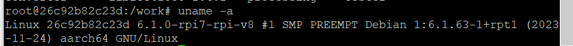
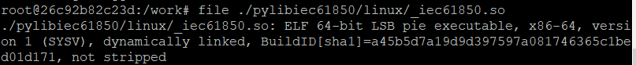
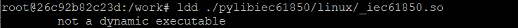
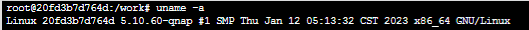
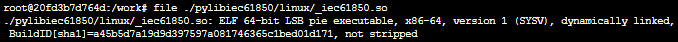
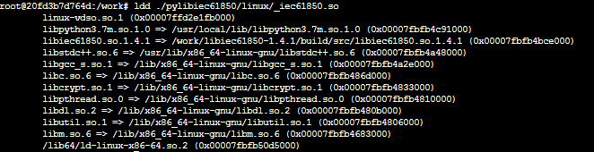
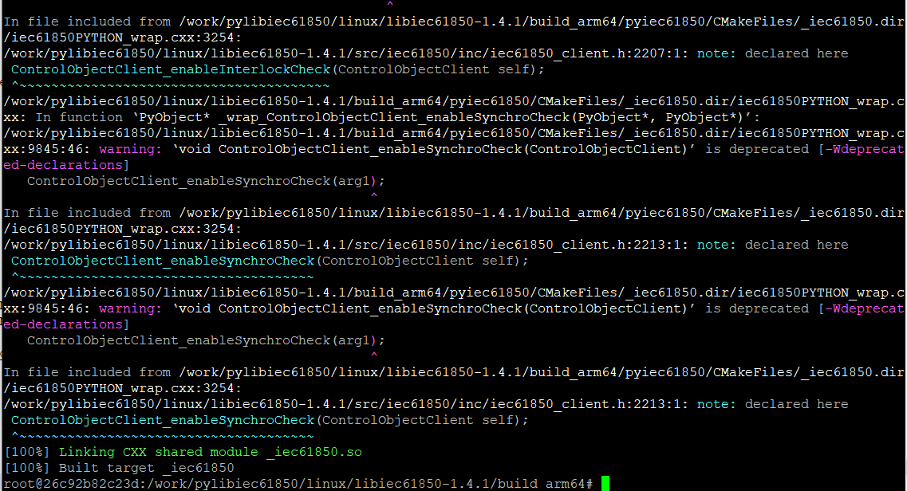

# Compiling libiec61850 for Python on ARM64 platform

### Why is compatibility a problem?

First of all, arm64 and x86-64 applications differ a lot, it is basically not easy to run them in a crossing-platform fashion.

Even though there are emulators like [box86](https://box86.org/) and [FEX](https://github.com/FEX-Emu/FEX) allowing for running x86-64 application on arm64 OS, the performance can not be guaranteed. You can find many posts that state this and recommend you not to use them.

So what happens if you get the wrong version of libiec61850 on a raspberry pi? 

By the command `uname -a`, we can check the basic information of the linux system (in this case the arm64 based pi OS). We can see it is an aarch64 (arm64) system.

When we place a x86-64 version of pylibiec61850 on pi, check the file information with 

      file <filepath of the source object>
and

      ldd <filepath of the source object> 

Apparently the file _iec61850.so can not be executed by pi since it is x86-64 based.

While if we had it on a x86-64 based OS, it would work well.

It is quite clear, we need to re-compile it on raspberry pi to make the pylibiec61850 compatible.

### How to compile for a raspberry pi?
The compiling process for ARM64 platform applications is quite similar to that of AMD64 OS. The major difference is that we need a compiler container on the right platform (e.g. 64-bit raspberry pi 4).

Note that the Pi earlier than pi4 depends on 32-bit platform (e.g. armv7l), but the compiling process should be the same. This also applies to other 32/64-bit based linux devices.
Always make sure that you are compiling on the right operating system.

Assuming there is a 64-bit raspberry pi at hand, a docker-compose container has been prepared, make sure your pi has an internet connection, let's start from here.

### Procedures for the compiling

1. Create docker container

    For simplification, we skip the preparation part for docker build (If you haven't seen that instruction yet and wants to know more about it, feel free to step over: [link for x86-64 tutorial](./Compiling_Python_linux_x86-64.md)). 

    We assume that you all know how to get into pi os using putty and ssh, you can either copy the libiec61850 source package from the host PC or use git to clone it from remote git server.

    To copy file onto raspberry pi, do this:
   
        scp <host filepath> <user on pi>@<pi IP>:~/<pi file path>
    
    To copy a directory onto raspberry pi, do this:
    
        scp -r <host filepath> <user on pi>@<pi IP>:~/<pi file path>
    
    Of course, you can use it reversely to copy files from pi, which will be needed to later export the compiled lib.

        scp <user on pi>@<pi IP>:~/<pi file path> <host filepath>

        scp -r <user on pi>@<pi IP>:~/<pi file path> <host filepath>

    To use git clone, get your git certs stored on pi in the folder `/etc/ssl/certs`, install git and then clone, e.g. do this:

        git clone https://github.com/mz-automation/libiec61850

2. Build and attach to the compiler docker container

    Since we are not using docker desktop anymore, a more practical way is required to manage and attach to the container.

    First build a container with docker-compose and attach to it using bash:

        docker-compose run pylibiec61850compiler bash

    If you need to later attach to that container again, just get the container id and do this:

        docker exec -ti <container id> bash

3. Now we start compiling in the docker, almost the same as the x86-64 compiling

       apt-get update
       apt-get upgrade
       apt install cmake build-essential python3 swig
       cd <folder name of the libiec61850 source files>
       mkdir build
       cd build
       cmake -DBUILD_PYTHON_BINDINGS=ON ..
       make

   Attention: the name of the `build` repository may impact the later use of the compiled project as a whole. Thus We recommend to just name it `build`.

   After the compiling finished successfully, this view will appear, congratulation:

   

4. Export the compiled library for later use.

   If you want to re-use the lib on another device, you might not want to redo this whole process many times, so let's copy it from container to our host PC.

   1) First detach from container by pressing ctrl+p and then ctrl+q

   2) Then copy the file from docker container to pi.

           docker cp <container ID>:/<file path > ~/

   3) Now the last step, copy the file from pi to host PC in putty:

           scp -r <user on pi>@<pi IP>:~/<pi file path> <host filepath>

By this step, we are done with the compiling for raspberry pi. If you need a specific version, feel free to 
try it out by yourself!