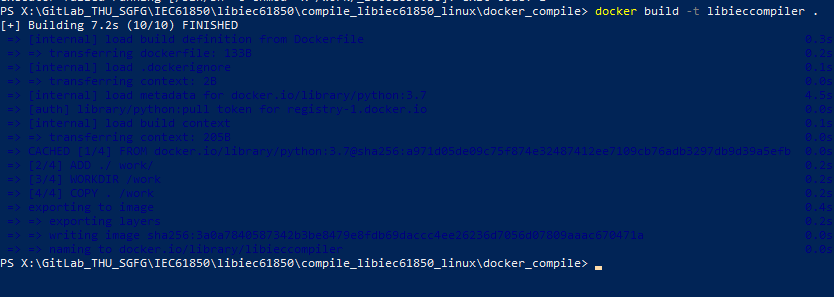
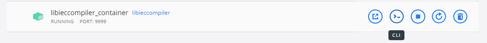
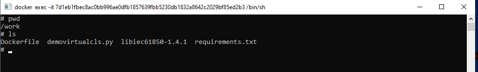
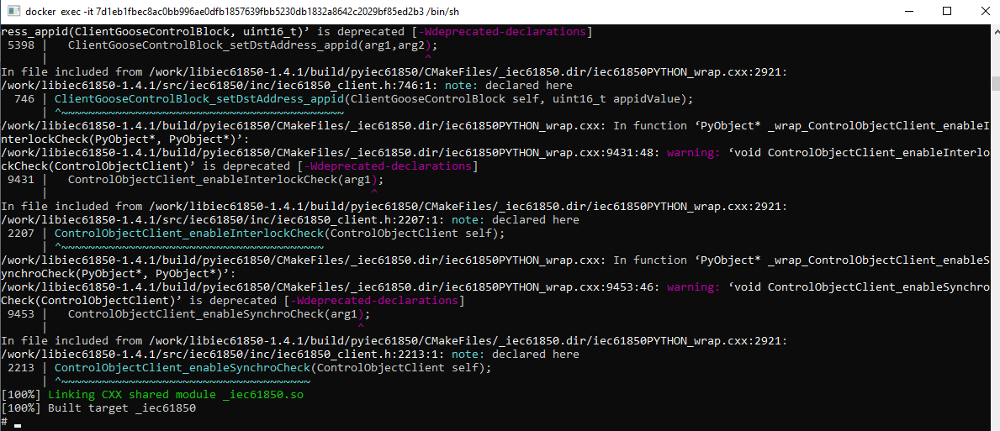
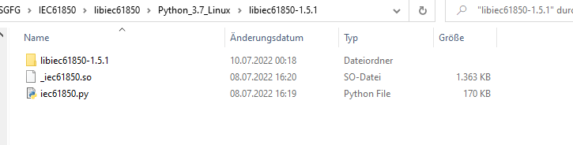
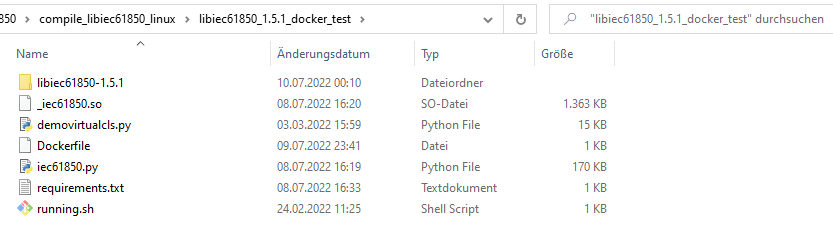
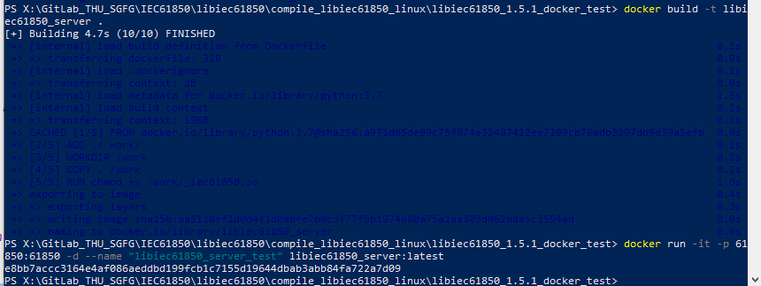
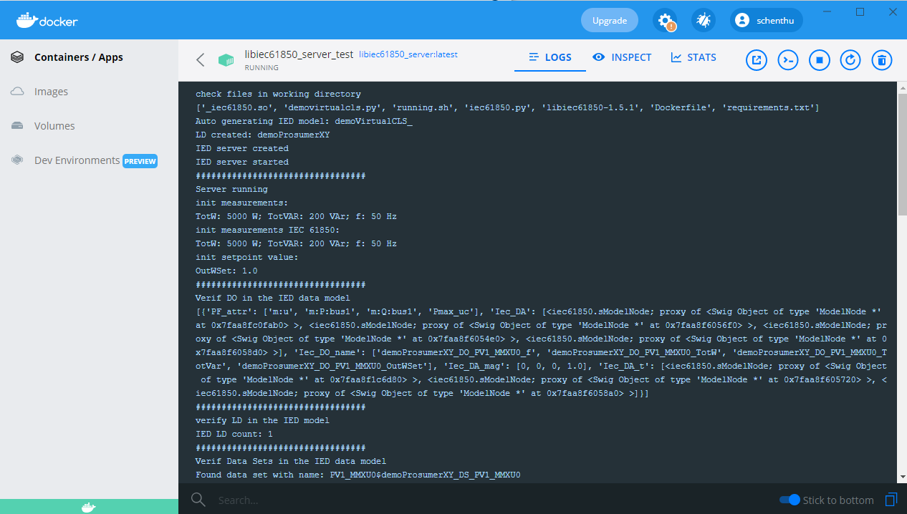
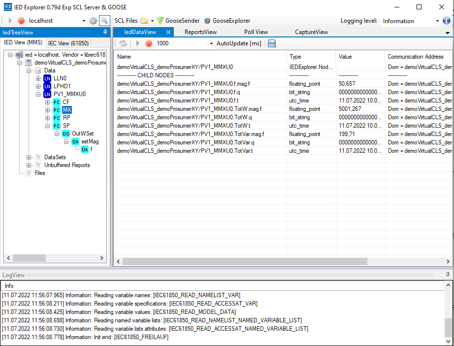
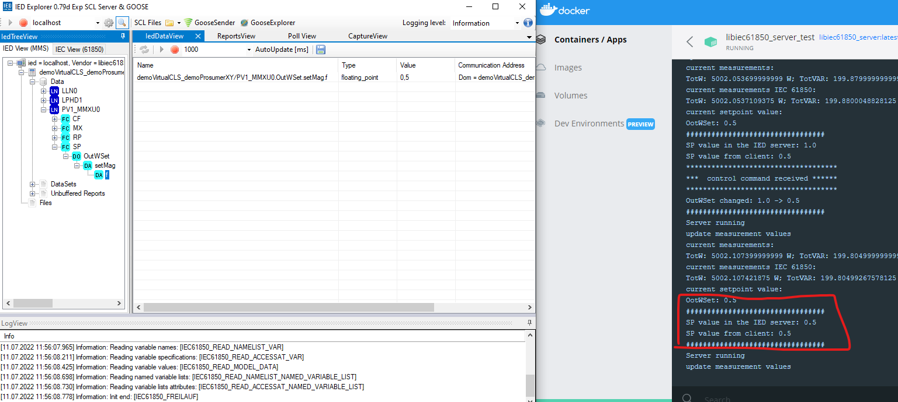

# Compiling libiec61850 for Python on AMD64/x86-64 platform

Compared to the compiling in windows, the thing for linux will be a little bit more complicated, as we need
Linux-based environment and tools to make it work. As I work quite a lot with docker applications, I personally
recommend using a docker container to compile the lib.

We first start with the compiling process for AMD platform (x86-64) applications.

### Preparation:
Following tools will be needed for the compiling:
- an AMD64/x86-64 linux environment (e.g. Docker desktop or any other kind of virtual machine)
- if Docker desktop is used, then we also need a pre-configured WSL2 environment to transfer files between Linux and your
windows OS, I simply used Windows powershell that is already prepared for Docker.
- the source file of libiec61850
- a python script to test whether it works (A script named demovirtualcls.py is prepared)
- the testing tool IED Explorer to test the python libiec61850 server

### Procedures for the compiling
1. Create docker container
    
    Just take an empty container with Python environment, do the following steps:

    1) create a repository in windows OS, copy the libiec61850 source folder to it.
    2) (optional) create or copy a requirement.txt file to include necessary libs, actually we don't need any extra lib 
    for the initialization of the docker container.
        
    3) create or copy a Dockerfile (without extension) containing the following content     
        
            FROM python:3.7
            ADD ./ work/
            WORKDIR /work
            COPY . /work
            ENV PYTHONPATH "${PYTHONPATH}:/work"
                
    4) Open powershell as administrator(this is important!), cd to that directory in powershell, and run docker build with:
    
            docker build -t libieccompiler .

       If the build finishes without error, then we can proceed to docker desktop.
       
       

2. Run the docker via powershell command:
            
        docker run -d -it -p 9999:9999 --name libieccompiler_container libieccompiler
       
   or just click on "Run" in Docker desktop - Images.
       
   Afterwards, you may switch to Containers/Apps and use CLI to inspect the docker container.
       
   
       
   use `docker container list` to list all running containers and note the CONTAINER ID of ours.
       
   If you forget to copy the source file before docker build, now you can still cp files via this command:
       
            docker cp <path of libiec source file in windows> <container id>:/work 
            
   Anyway you should have these dirs in the Docker CLI
       
   
            
3. Now we start compiling in the docker, perform the following commands in a row:

            apt update
            apt install cmake build-essential python3 swig
            cd <folder name of the libiec61850 source files>
            mkdir build
            cd build
            cmake -DBUILD_PYTHON_BINDINGS=ON ..
            make
        
    When it goes well, we would have the shared object _iec61850.so successfully created.
        
     
        
4. After compiling is done, go to windows powershell to copy out the python libraries
        
    Just copy the entire work folder out, then you can check your python lib in `../work/build/pyiec61850`, the two files iec61850.py and _iec61850.so are needed for Python libiec61850 applications in linux.
            
    use cd navigating back to root level, and change mode in case we would run into privilege problem:
        
            chmod 0777 /work
        
    Then copy the entire work directory out by executing:
        
            docker cp <Container ID>:/work <local path to store the files>
        
    Note: remember we started powershell as administrator? If you haven't done so, here you will possibly get the error "A required privilege is not held by the client." during the copying process.

5. Prepare the pylibiec61850 lib for Linux application
    
   Unlike the pylibiec61850 for windows, where one only need the two pyd and py files, nothing else, the 
   Linux lib does require user to put the entire source package within the same directory, otherwise running 
   the pylibiec61850 application would throw back an error saying the the source object can not be found.
        
   This speciality makes the package looks pretty much like this, and surely enlarges the minimum package size of an depending linux application.
        
    
        
        

### run docker container
After we have the linux lib in the hand, a simply tester for its functionality would worth a shot. Just stay in
power shell and copy the same files in the compiler container in a new folder, or download the files from this gitlab
 project, and then rename the folder as some "tester":

Remember that we need the iec61850.py file, the _iec61850.so file AND also the entire source package we got after
successful compiling. 

Make sure the Dockerfile carries the following contents:

    FROM python:3.7
    ADD ./ work/
    WORKDIR /work
    COPY . /work
    ENV PYTHONPATH "${PYTHONPATH}:/work"
    RUN chmod +x /work/_iec61850.so
    CMD ["python","/work/demovirtualcls.py"] 

And the bash file running.sh is just a two-liner.

    #!/bin/sh
    
    echo "Start virtual CLS service"
    python demovirtualcls.py

Here is an overview of the files in that directory:

 

Now execute the following commands in powershell to build and start the tester container:

    docker network create -d bridge libiec61850-network
    docker build -t libiec61850_server .
    docker run -it --rm -p 127.0.0.1:61850:61850 -d --name "libiec61850_server_test" libiec61850_server:latest

When it goes well, you see no error in powershell and the docker container runs in docker desktop.

 

 

In the last step, open IED Explorer, set the address as 127.0.0.1 and the port as 61850 (one might need to set
a firewall rule for this tcp port), click on connect, what do you see? 

 

Here we could also test the control with the simplified test model, it works!

 

I hope you will have some fun with this lib!