# Compiling libIEC61850 for Python in windows

## Brief overview
The compiling process for Windows application is originally documented by J. Morris in study project, which is based on 
the documentation provided by the official repository of libIEC61850. Later the compiling procedure has been been 
extended by S. Chen and tested by Z. Zhang (mainly for Linux applications).

<span style="color:red">NOTE:</span> **_the software provider mz-automation provides no support for python bindings, 
so we are kind of on our own._**

The compiling method proposed by J.Morris worked fine for the version 1.4.1, errors could occur during the compiling 
procedures of later versions, mainly due to GOOSE related functions that cannot be deactivated for cmake.

The compiled Python lib only works in Windows environment, the extension of the main lib _iec61850.pyd (renamed as 
pyiec61850.py starting from libIEC61850-1.6), indicates that the lib depends on DLL modules, which are not supported in linux.


## Compatibility of different libIEC61850 versions

You may use the table below to check whether your Windows Python environment allows you to run a simulation with a 
specific version of libIEC61850. If you are a Windows user, the only combination that currently works well is 
Python 3.7 + libIEC61850 1.4.1...

latest versions like 1.5 and 1.6 all have fatal problems with GOOSE functions in the python binding. 
Any kind of debugging effort is appreciated.

| libIEC61850/Python version |                    libIEC61850 1.4.1                    | libIEC61850 1.5.1 | libIEC61850 1.6 |
|:---------------------------|:-------------------------------------------------------:|------------------:|----------------:|
| Python 3.7                 |                compiling ok, pyServer ok                |   compiling error |            N.A. |
| Python 3.9                 | compiling ok, pyServer causes "connection rejected" error |   compiling error |            N.A. |
| Python 3.11                | compiling ok, pyServer causes "connection rejected" error |   compiling error |            compiling error|
| Python 3.12                | compiling ok, pyServer causes "connection rejected" error |   compiling error |            compiling error |


## Preparation
Download required (open source) build tools

- MS Visual Studio community edition  _(for this instruction, version 2022 was used)_
- swig (http://www.swig.org/download.html) _(for this instruction, version 4.2.1 was used, Windows users can 
  download a prebuilt executable. )_
- cmake (https://cmake.org/download/) _(for this instruction, version 3.30 was used)_


If you are not compiling with the default Python version on your machine:
- remember to set up the Python env for the desired version (e.g. by creating a new env in conda)
- you could try to change default python version in Git Bash: see Ibraheem Al-Dhamari's answer in this
[post](https://stackoverflow.com/questions/32965980/how-to-change-python-version-in-windows-git-bash). In my case it 
  was not sufficient to just change the default Python version. This setting is also not necessary for the compiling.


## Workflow for compiling
Please follow the following procedures to compile the libIEC61850 as a Python binding in windows:

	
1. update system variable by adding following paths to environment variable PATH
    
    <span style="color:red">HINT:</span> _the paths in this instruction can differ from actual ones on your machine, make sure to modify them 
   after copy-paste._

       - C:\Program Files\Microsoft Visual Studio\2022\Community\Msbuild\Current\Bin
       - C:\<user defined path>\cmake-3.30.3\bin
       - C:\<user defined path>\swigwin-4.2.1

2. download libIEC61850 stack
    
    From the homepage: https://libiec61850.com/downloads/

    or on git: https://github.com/mz-automation/libiec61850


3. Adjusting the cmake files for `pyiec61850`
    
    One vital working step here is to make sure that the required tools, and the proper version of them can be found 
   when executing cmake. Usually different Python version might cause problems, so we consider to different 
   situation here.
   
        case 1: Compiling for the latest Python version installed on your machine (the default one)
        case 2: Compiling for a specific Python version (we have to specify some more hyper parameters)

   1) <span style="color:red">(only relevant for case 1)</span> Compiling for the installed Python version
   
        This is a simple case, and this step is actually optional, only do this if cmake throws errors. We only need 
      to make minor changes and cmake can still find the proper versions automatically.
         
        Find the file `CMakeLists.txt` in the sub-folder `<path libIEC61850>/pyiec61850` (where the folder 
      "examples" and the interface file iec61850.i can be found)
        
        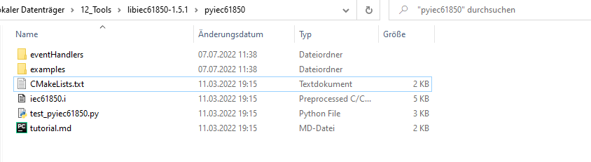
        
        Find the rows where Python interpreter and libs are specified:
   
        ```
        find_package(PythonInterp ${BUILD_PYTHON_VERSION} REQUIRED)
        find_package(PythonLibs ${PYTHON_VERSION_STRING} EXACT REQUIRED)
        ```
      
        Turn off the python version flag for find_package by changing it to:
      
        ```
        find_package(PythonInterp REQUIRED)
        find_package(PythonLibs REQUIRED)	
        ```

   2) <span style="color:red">(only relevant for case 2)</span> Compiling for a specific Python version
   
        The second case is much more complicated, we have to tell cmake the locations of Python interpreter, Python 
      libs and Python root path. For demonstration, the libIEC61850 stack was being compiled for Python 3.12 on a 
      machine with Python 3.11 as default. An env named env312 has been created in conda for compiling purpose.
   
        In this case, if we leave cmake with a required Python version and it cannot find it, then there is a 
      problem. So instead of doing that, we set the find_package lines to an EXACT version, AND also unset the 
      default `Python_EXECUTABLE`. So the two lines mentioned above will be replaced by:
   
        ```
        unset(Python_EXECUTABLE)
        find_package(PythonInterp 3.12 EXACT)
        find_package(PythonLibs 3.12 EXACT)	
        ```
        
        You might also try specifying the Python parameters directly in the CMAKELists, it didn't work for me. So 
      later we have to pass them as arguments when executing cmake:

      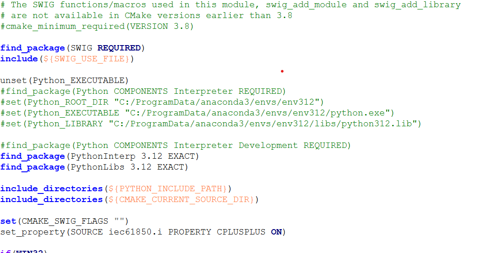
   
        In some cases, one might have to activate the new find_package syntax (e.g. for libIEC61850-1.6):
        
        ```
        find_package(Python COMPONENTS Interpreter Development REQUIRED)  
        ```

        To make this work, you also need to active the cmake minimum version on top:      

        ```
        cmake_minimum_required(VERSION 3.8)
        ```

4. Adjusting the cmake files for libIEC61850

    The last step is only for the `pyiec61850`, additionally we could also make some changes to the CMakeList 
   of the entire libIEC61850 stack.

    Go back to the root directory, open the `…\libiec61850\CMakeLists.txt` file, activate the build flag for python, 
   optionally deactivate the examples if not needed:
      
      ```
      option(BUILD_EXAMPLES "Build the examples" ON)
      option(BUILD_PYTHON_BINDINGS "Build Python bindings" OFF)
      ```
      
      should be changed as:
      
      ```
      option(BUILD_EXAMPLES "Build the examples" OFF)
      option(BUILD_PYTHON_BINDINGS "Build Python bindings" ON)
      ```

    You can also play around with other settings, e.g. deactivating GOOSE functions if not required. Now we are 
   ready to call cmake.


5. generate solution file using cmake

    Working steps:
    - open Git Bash or any other CMD terminal, navigate to the folder `<path libIEC61850>/pyiec61850 `
    - Then run a cmake to generate solution files for the `pyiec61850` module
    - go back to root directory, create a sub-folder named `build` and cd into it (it is a good practice to always 
      name this folder "build", for linux applications this folder name will be included in many dependency files, 
      you don't want to bother change file names everywhere) 
    - Run a second cmake to generate solution files for the entire `libIEC61850` stack

    On command lines, the commands still depending on the choice Python version.

    1) <span style="color:red">(only relevant for case 1)</span> Compiling for the installed Python version
   
        For the simpler case, just run the following (remember to change the VS Studio version):
    
          ```
          cd <local path of libIEC61850>
          cd pyiec61850   
          cmake -G "Visual Studio 17 2022"
          cd ..
          mkdir build
          cd build
          cmake -G "Visual Studio 17 2022" ..  
          ``` 
        
          On the last line, `..` means use the Cmakefile in parent dir, do not forget it.        

          After cmake in `./pyiec61850`, a .sln file should haven been generated along with several VS project files. Open 
       this file Project.sln in VS 2022, you should see the "_iec61850" module (pyiec61850.py as of libIEC61850-1.6) in the 
       project file list.
            
          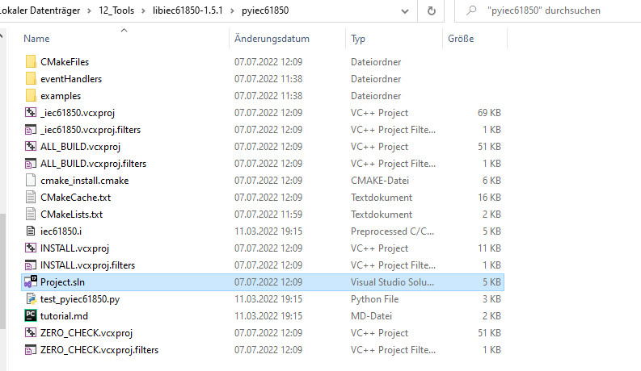         

    2) <span style="color:red">(only relevant for case 2)</span> Compiling for a specific Python version
   
       Here we also have the complicated case, since we failed to pass Python settings directly using the CMakeLists 
       file, here we have to specify them as cmake arguments (remember to change the VS Studio version and python 
       paths):

          ```
          cd <local path of libIEC61850>
          cd pyiec61850   
       
          cmake -G "Visual Studio 17 2022" -DPython_ROOT_DIR="C:\ProgramData\anaconda3\envs\env312" \
          -DPYTHON_LIBRARY="C:\ProgramData\anaconda3\envs\env312\libs\python312.lib" \
          -DPYTHON_EXECUTABLE="C:\ProgramData\anaconda3\envs\env312\python.exe" 
          
          cd ..
          mkdir build
          cd build
       
          cmake -G "Visual Studio 17 2022" .. -DPython_ROOT_DIR="C:\ProgramData\anaconda3\envs\env312" \
          -DPYTHON_LIBRARY="C:\ProgramData\anaconda3\envs\env312\libs\python312.lib" \
          -DPYTHON_EXECUTABLE="C:\ProgramData\anaconda3\envs\env312\python.exe" 
          ``` 

          <span style="color:red">HINT:</span> cmake must be able to find the required tools, otherwise there is a chance that cmake throws 
       back errors in the end.
   
          How it looked like use automatic find_package (Python 3.11):

          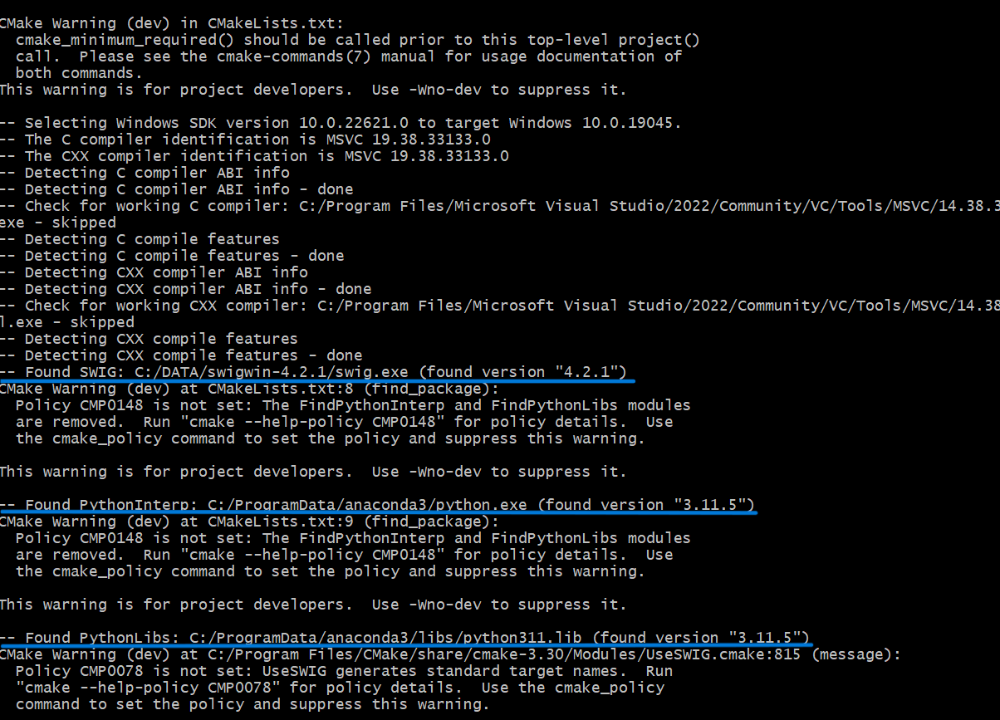
    
          How it looked like when a specific Python version is defined (Python 3.12):  
          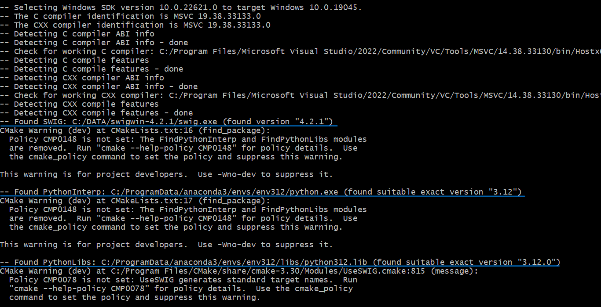
        
        <span style="color:red">HINT:</span> if you encountered any cmake error and would like to 
       redo a cmake after changing settings, remember to 
       delete the file `CMakeCache.txt` and then execute new cmake, otherwise cmake might repeat the same loop over and 
       over again.

    If everything works fine, you should be able to see the solution files and VS projects:
	    
	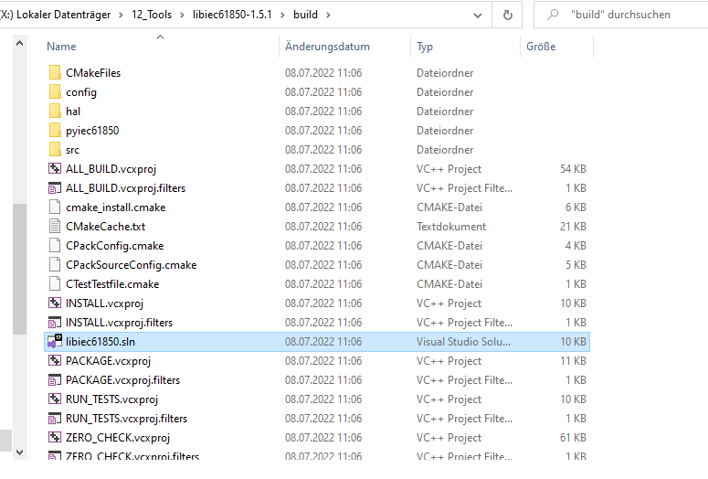 
	

6. build libIEC61850
    
    In the `build` folder, a sub-folder `pyiec61850` will also be generated after by cmake, depending on 
	the user configuration in CMakeList file and the previously generated `pyiec61850` module using the first cmake. 
   Normally we do not have to change anything, just open the sln file `./build/libiec61850.sln` in VS Studio and the 
   pyiec61850 module should automatically show up in the list (as `_iec61850` or `pyiec61850`).

   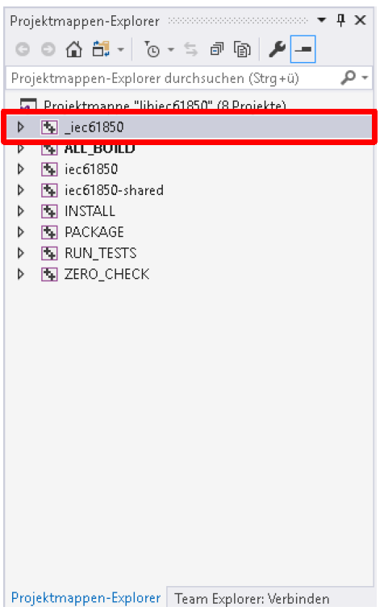

	Just ignore the example files or deactivate examples in the cmake config file.	

	Then use a right-click on the project _iec61850 and choose Eigenschaften/Settings, open the
	 configuration manager and pick the required projects. Make sure you have them as Release configured. 
	
	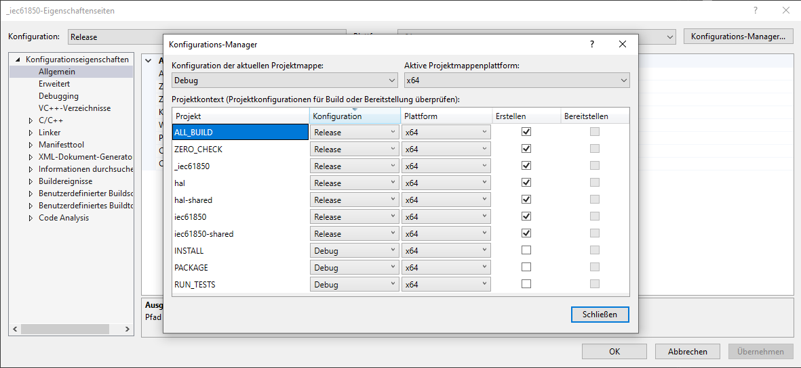
	
	Then make a right-click on the project _iec61850 and choose Erstellen/build, here you go. The build 
	process will take a while, ignore the warnings as long as the process is not forced stopped.
	

7. check the compiled python lib:

    The build process can be considered as successful, if no error was reported and these two python files can
    be found: 	
    
    `...\build\pyiec61850\Release\_iec61850.pyd`
    
    `...\build\pyiec61850\iec61850.py`
	
	 Copy them out, this is now your pylibiec61850 library, have fun with it!


## Quick debugging

- `[LNK1104]` Python **_.lib can not be opened_** error 
    
    If the missing lib happens to be a python lib, e.g. in our case the `python312.lib` file, then you may just drag 
  that file from Windows Explorer and drop it into the VS Studio compiling project, that should wipe out the 
  error.
 
    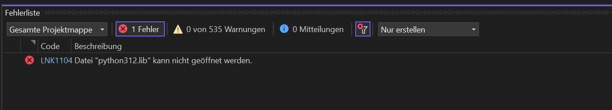       


- `[C1083]` **_Can not open python.h file_** error 

    This error is probably caused by a wrong version of Python interpreter (which you might have missed to see 
  during cmake), in that case double check the output of cmake logs and make sure that cmake uses the correct Python 
  Libs and Python Interpreter

   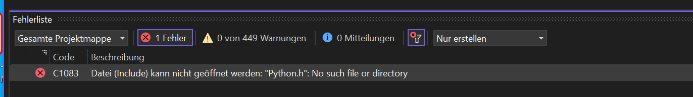    


- **_lib can not be opened**_ error
    
    If any error indicating "xxx.lib can not be opened" shows up during the compile process, it could mean that this 
  lib was not properly generated/compiled by cmake. One might consider compile this sub-project at first, before 
  proceeding to the compiling of the whole libIEC61850 project.
     (e.g. hal.lib and hal-shared.lib -> if these two can not be opened, then firstly go to 
     build\hal and load hal.sln in Visual Studio, build the project with hal, hal-shared,
     ALL-BUILD and ZERO_CHECK as release, if it succeeded, a hal.lib will be generated in 
     build\hal\Release. Then you can proceed to the compiling of the entire project.)


- other errors
    
    we have no experience for fixing other errors, help yourself, kid.
     
 ## Known restrictions
 ### libIEC61850 version 1.5 and later
 During the compiling process, Visual Studio throws a GOOSE related error back. Setting the GOOSE functionalities to 
 `OFF` in the CMakeLists file can not solve the problem.


 ### libIEC61850 version 1.4.1 + Python 3.9 and later
The IEC 61850 server seems to be fine, but whenever a client request an IEC 61850 MMS connection, it just gets 
stuck at `[OSI_CONNECT_COTP]`, no TCP connection can be established. Servers using Python 3.7 do not have this issue.

 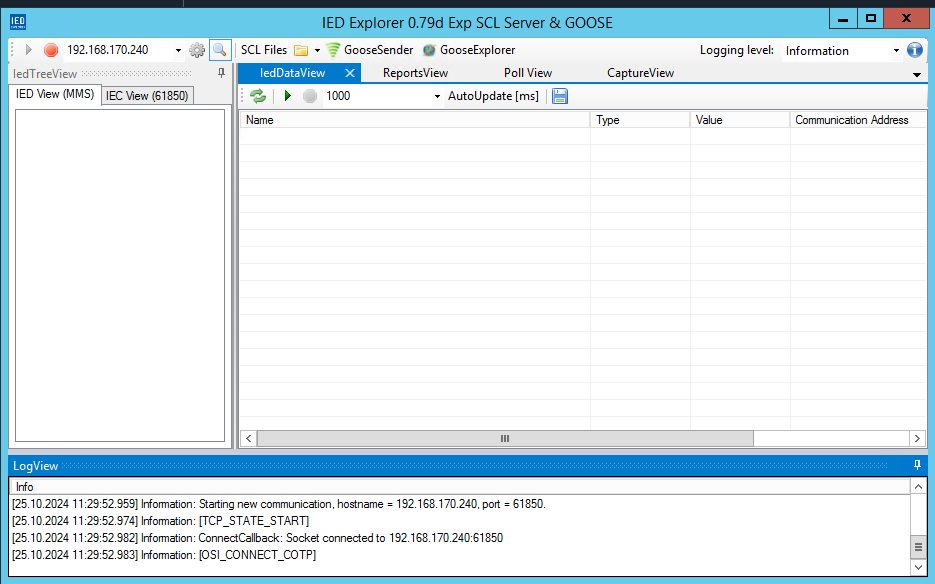
 

### Relevant posts
Thanks to following posts, a practical compiling workflow can be created:

- hints provided by cmake official documentation: https://cmake.org/cmake/help/latest/module/FindPython3.html
- hint for `unset(Python_EXECUTABLE)`: https://gitlab.kitware.com/cmake/cmake/-/issues/23139
- hint for setting default Python version in Git Bash (inspired by Lane Retting's anwser): https://stackoverflow.com/questions/24174394/cmake-is-not-able-to-find-python-libraries 