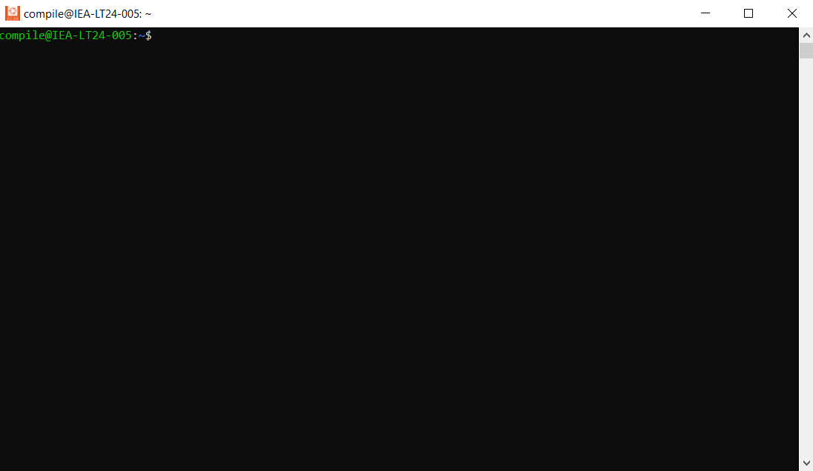

# Linux compilation work-flow

## Python Installation

1. Start → Ubuntu22.04.5 LTS
2. Dialog box like this will pop up:



1. Install the python version you want:

```bash
sudo apt-get install python3.x python3.x-dev python3.x-venv
```

1. Confirm the installation

```bash
python3.x --version
```

1. Create the Virtual Environment

```bash
python3.x -m venv ~/py3xenv
```

1. Activate the Virtual Environment

```bash
source ~/py3xenv/bin/activate
```

1. Check for python version

```bash
python --version
```

1. You should see:

```bash
Python 3.X.X
```

## Compilation

- Change the directory to the libiec61850 1.X.X folder

```bash
cd ~/libiec61850-1.5.1
```

- Create a Directory for the specific python

```bash
mkdir buildpy311
cd buildpy311
```

- Configure the Build with Cmake

```bash
cmake -DPYTHON_EXECUTABLE=$(which python) -DBUILD_PYTHON_BINDINGS=ON ..
```

This command tells CMake to:

- Use the current Python interpreter from the virtual environment (Python 3.X).
- Enable the Python bindings by setting `BUILD_PYTHON_BINDINGS` to `ON`.
- Compile the library

```bash
make
```

- Install the library

```bash
sudo make install
sudo ldconfig
```

1. `sudo make install` copies the files to the appropriate directories.
2. `sudo ldconfig` updates the dynamic linker cache so your system recognizes the newly installed library.
- Run the integrated test

```bash
make test
```

should return this:

```bash
Running tests...
Test project /home/compile/libiec61850-1.5.1/build311
    Start 1: test_pyiec61850
1/1 Test #1: test_pyiec61850 ..................   Passed    0.16 sec

100% tests passed, 0 tests failed out of 1

Total Test time (real) =   0.16 s
```

## Testing

Go back to the parent folder

```bash
cd ..
cd pyiec61850
python test_pyiec61850.py
```

should return this:

```bash
[0.0, 0]
[10.0, 0]
client ok
```

Now test the server example:

Go up the parent folder: libIEC61850 

Then go to build → examples → server_example_basic_io then run server_example_basic_io using

```bash
sudo ./server_example_basic_io
```

It will look like this:


Test on IED explorer: Now run the IED explorer and Go to settings and add the port to 102 for basic server example. Then press the play button and the output should look like this:
**IED :**


**Ubuntu:**


Press Ctrl + C to exit this program and to do the compilation for other python version, just repeat this process for different python version. 

### **Change in the compilation:**

1. Made changes in the CMakeLists.txt file to replace distilutils as it is deprecated from python 3.12 versions. 

Replaced the execute process part of the code where distilutils was used with setuptools. 

- First go to:  pyiec61850/CMakeLists.txt
- Locate the block where the install destination is determined. It should be similar to:

```bash
execute_process(
  COMMAND ${PYTHON_EXECUTABLE} -c
  "from distutils.sysconfig import get_python_lib; import sys; sys.stdout.write(get_python_lib())"
  OUTPUT_VARIABLE PYTHON_SITE_DIR
)
```

with this code:

```bash
execute_process(
	COMMAND ${PYTHON_EXECUTABLE} -c "from setuptools._distutils.sysconfig import get_python_lib; import sys; sys.stdout.write(get_python_lib())"
	OUTPUT_VARIABLE PYTHON_SITE_DIR
)

```

- Then activate your environment and run this command

```bash
pip install --upgrade setuptools
```

Then Re-run the Cmake and build

```bash
cd ~/libiec61850-1.5.1/build_py312
cmake -DPYTHON_EXECUTABLE=$(which python) -DBUILD_PYTHON_BINDINGS=ON ..
```

### To get a new version of libiec61850

```bash
git clone https://github.com/mz-automation/libiec61850.git
```