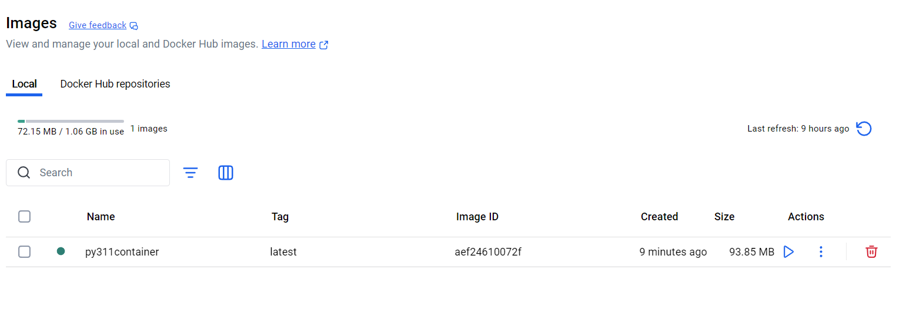

# Docker Container compilation workflow for AMD64

### Special case  for libiec61850 1.4.1

**Edit** `hal/serial/linux/serial_port_linux.c` (in your source tree, *not* the build directory) and add these two lines *immediately after* the existing includes (e.g. after `#include <errno.h>`):

```diff
diff
CopyEdit
--- a/hal/serial/linux/serial_port_linux.c
+++ b/hal/serial/linux/serial_port_linux.c
@@
 #include <termios.h>
 #include <errno.h>
+ #include <sys/types.h>
+ #include <sys/time.h>
+ #include <sys/select.h>
 #include "serial_port_linux.h"
 …

```

or directly replace this as a new serial_port_linux.c

[serial_port_linux.c](../libiec61850_source/serial_port_linux.c)

### Special case  for libiec61850 1.6.0

To compile the libiec61850 for 1.6.0 , a small change has to be made in the source file before the whole compilation process.

Redirect to source code `libiec61850-1.6\pyiec61850` and open the iec61850.i file and add these lines in the starting to ignore the Goose Publisher 

```c
/* File : iec61850.i */
%module(directors="1") pyiec61850       /*NOTE: new changed in version 1.6.0*/
 %ignore GoosePublisher_createRemote;    /*NOTE: new added*/
%ignore GooseReceiver_createRemote;     /*NOTE: new added*/
%ignore ControlObjectClient_setTestMode(ControlObjectClient self);
```

or just replace the existing file iec61850.i with this:

[iec61850.i](../libiec61850_source/iec61850.i)

Then carry on the workflow like usual.

### PREPARATION:

1. Make a new folder in C: drive, name it as libiec61850”pyversion”
2. Copy the libiec61850 source file. 
3. Make a new Dockerfile by opening a notepad and add the below code in this notepad:

```docker
 FROM python:3.x-alpine #Add python version name instead of X here
 ADD ./ work/
 WORKDIR /work
 COPY . /work
 ENV PYTHONPATH "${PYTHONPATH}:/work"
```

1. Then open powershell as administrator. 
2. Run docker-desktop in your system. If you haven’t installed the docker desktop in your system. You can install it from here: [Get Started | Docker](https://www.docker.com/get-started/)
    1. New to docker, this video can help you install and understand the basics of Docker: [https://youtu.be/pg19Z8LL06w?feature=shared](https://youtu.be/pg19Z8LL06w?feature=shared)
3. And direct the powershell to the new-made folder/desired folder of compilation. 

```bash
PS C:\Windows\system32> cd ..
PS C:\Windows> cd ..
PS C:\> cd .\Projects\
PS C:\Projects> cd .\libiec61850_311_alpine\
```

1. Then build the docker image using this:

```bash
PS C:\Projects\libiec61850_311_alpine> docker build -t py311container .
```

You can name the container as per pyX as per the python version you are compiling. 

1. Now open the dockerdesktop app and you’ll see image like this:



1. Now connect the image to the container with this:

```bash
PS C:\Projects\libiec61850_311_alpine> docker run -d -it -p 9999:9999 --name py311container py311container
```

Now you will see the container like this:


After this open the py311 container and go to the exec dialog box like here 


### COMPILATION:

After this perform following codes in the exec command prompt

```bash
apk update 
apk add --no-cache cmake build-base swig linux-headers
pip install --upgrade setuptools # only for python 3.12 and 3.13
cd libiec61850-1.5.1
mkdir build
cd build
cmake -DBUILD_PYTHON_BINDINGS=ON ..
make -j$(nproc) # uses all the processors (faster make)
```

After running this code you’ll get this result:


**ALTERNATE FOR LOW SIZE CONTAINER**

```bash
apk update && \
apk add --no-cache --virtual .build-deps cmake build-base swig linux-headers python3-dev && \
# [Run your build commands here...]
apk del .build-deps && \
rm -rf /var/cache/apk/*
```

### SERVER TESTING

For testing, create a new folder inside libiec61850_311_alpine and name it as python_310_alpine like this and inside it make a new folder python_test and then copy the :work folder along with python_test in the same folder like this. 

```bash
docker cp <container_name>:/work <file path>
```


Inside the python_test file copy the source libiec61850-1.5.1 from the work folder, then copy the so and py file 
along with the [requirements.txt](../tester/requirements.txt) and [running.sh](../tester/running.sh) file. Make a new 
Dockerfile for server testing (a [template Dockerfile](../tester/Dockerfile) is available). 
the folder should look like this:


In the dockerfile add this code:

```docker
FROM python:3.11-alpine

# Install libstdc++ as a runtime dependency.
RUN apk add --no-cache libstdc++

WORKDIR /work
COPY . /work
# Uncomment the following line if you need to install Python packages:
# RUN pip install -r requirements.txt
ENV PYTHONPATH=/work
RUN chmod +x /work/_iec61850.so
CMD ["python", "/work/demovirtualcls.py"]
```

Now go back to powershell and setup the server_testing docker image:

First go to the python directory with this code:

```bash
PS C:\Projects\libiec61850_311_alpine> cd .\python_311_alpine\
PS C:\Projects\libiec61850_311_alpine\python_311_alpine> cd .\python_test\
```

```bash
docker network create -d bridge libiec61850-network
docker build -t libiec_server .

```


 Then connect the server using this code:

```bash
docker run -it -p 127.0.0.1:61850:61850 -d --name "libiec61850_server_test" libiec_server:latest
```

This will be the final output:


Now run the IED explorer and change the port to 61850 and IP address to 127.0.0.1. The press the green play button and you will see a connection to the server:


To check which container is using the port

```docker
docker ps --filter "publish=61850"
```

To remove any container

```docker
docker stop <container_name>
```

###